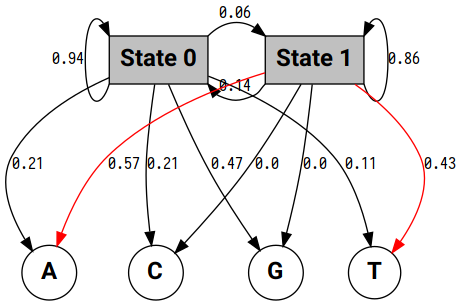

=====
mchmm
=====

.. image:: https://travis-ci.org/maximtrp/mchmm.svg?branch=master
    :target: https://travis-ci.org/maximtrp/mchmm
.. image:: https://img.shields.io/github/issues/maximtrp/mchmm.svg
    :target: https://github.com/maximtrp/mchmm/issues
.. image:: https://codecov.io/gh/maximtrp/mchmm/branch/master/graph/badge.svg
    :target: https://codecov.io/gh/maximtrp/mchmm
.. image:: https://api.codacy.com/project/badge/Grade/5f11c78b10e943d7a95dae3ac72ff135
    :target: https://www.codacy.com/app/maximtrp/mchmm?utm_source=github.com&amp;utm_medium=referral&amp;utm_content=maximtrp/mchmm&amp;utm_campaign=Badge_Grade
.. image:: https://pepy.tech/badge/mchmm
    :target: https://pepy.tech/project/mchmm
.. image:: https://img.shields.io/pypi/v/mchmm.svg
    :target: https://pypi.python.org/pypi/mchmm/

*mchmm* is a Python package implementing Markov chains and Hidden Markov models in pure NumPy and SciPy.

Dependencies
------------

* `NumPy <https://www.numpy.org/>`_
* `SciPy <https://www.scipy.org/>`_

Installation
------------

1. Install from PyPi:

.. code:: bash

  $ pip install mchmm

2. Clone a GitHub repository:

.. code:: bash

  $ git clone https://github.com/maximtrp/mchmm.git
  $ cd mchmm
  $ pip install . --user

Features
--------

Discrete Markov chains
~~~~~~~~~~~~~~~~~~~~~~

Initializing a Markov chain using some data.

.. code:: python

  >>> import mchmm as mc
  >>> a = mc.MarkovChain().from_data('AABCABCBAAAACBCBACBABCABCBACBACBABABCBACBBCBBCBCBCBACBABABCBCBAAACABABCBBCBCBCBCBCBAABCBBCBCBCCCBABCBCBBABCBABCABCCABABCBABC')

Now, we can look at the observed transition *frequency* matrix:

.. code:: python

  >>> a.observed_matrix
  array([[ 7., 18.,  7.],
         [19.,  5., 29.],
         [ 5., 30.,  3.]])

And the observed transition *probability* matrix:

.. code:: python

  >>> a.observed_p_matrix
  array([[0.21875   , 0.5625    , 0.21875   ],
         [0.35849057, 0.09433962, 0.54716981],
         [0.13157895, 0.78947368, 0.07894737]])

Here is the directed graph of the Markov chain:

.. image:: images/mc.png

Pandas can help us annotate columns and rows:

.. code:: python

  >>> import pandas as pd
  >>> pd.DataFrame(a.observed_matrix, index=a.states, columns=a.states, dtype=int)
      A   B   C
  A   7  18   7
  B  19   5  29
  C   5  30   3

Viewing the expected transition frequency matrix:

.. code:: python

  >>> a.expected_matrix
  array([[ 8.06504065, 13.78861789, 10.14634146],
         [13.35772358, 22.83739837, 16.80487805],
         [ 9.57723577, 16.37398374, 12.04878049]])

Calculating Nth order transition probability matrix:

.. code:: python

  >>> a.n_order_matrix(a.observed_p_matrix, order=2)
  array([[0.2782854 , 0.34881028, 0.37290432],
         [0.1842357 , 0.64252707, 0.17323722],
         [0.32218957, 0.21081868, 0.46699175]])

Carrying out a chi-squared test:

.. code:: python

  >>> a.chisquare(a.observed_matrix, a.expected_matrix, axis=None)
  Power_divergenceResult(statistic=47.89038802624337, pvalue=1.0367838347591701e-07)

Finally, let's simulate a Markov chain given our data.

.. code:: python

  >>> ids, states = a.simulate(10, start='A', seed=np.random.randint(0, 10, 10))
  >>> ids
  array([0, 2, 1, 0, 2, 1, 0, 2, 1, 0])
  >>> states
  array(['A', 'C', 'B', 'A', 'C', 'B', 'A', 'C', 'B', 'A'], dtype='<U1')
  >>> "".join(states)
  'ACBACBACBA'

Hidden Markov models
~~~~~~~~~~~~~~~~~~~~

We will use a fragment of DNA sequence with TATA box as an example. Initializing a hidden Markov model with sequences of observations and states:

.. code:: python

  >>> import mchmm as mc
  >>> obs_seq = 'AGACTGCATATATAAGGGGCAGGCTG'
  >>> sts_seq = '00000000111111100000000000'
  >>> a = mc.HiddenMarkovModel().from_seq(obs_seq, sts_seq)

Unique states and observations are automatically inferred:

.. code:: python

  >>> a.states
  ['0' '1']
  >>> a.observations
  ['A' 'C' 'G' 'T']

The transition probability matrix for all states can be accessed using ``tp`` attribute:

.. code:: python

  >>> a.tp
  [[0.94444444 0.05555556]
   [0.14285714 0.85714286]]

There is also ``ep`` attribute for the emission probability matrix for all states and observations.

.. code:: python

  >>> a.ep
  [[0.21052632 0.21052632 0.47368421 0.10526316]
   [0.57142857 0.         0.         0.42857143]]

Converting the emission matrix to Pandas DataFrame:

.. code:: python

  >>> import pandas as pd
  >>> pd.DataFrame(a.ep, index=a.states, columns=a.observations)
            A         C         G         T
  0  0.210526  0.210526  0.473684  0.105263
  1  0.571429  0.000000  0.000000  0.428571

Directed graph of the hidden Markov model:

Running Viterbi and Baum-Welch algorithms on new observations.

.. code:: python

  >>> new_obs = 'GGCATTGGGCTATAAGAGGAGCTTG'
  >>> vs, vsi = a.viterbi(new_obs)
  >>> bws, bwsi = a.baum_welch(new_obs, iters=5, pi=[1,0], end=[1,0])
  >>> # states sequences obtained with both algorithms
  >>> print(VI, "".join(vs))
  >>> print(BW, "".join(bws))
  >>> # observations
  >>> print(NO, new_obs)

::

  VI 0000000001111100000000000
  BW 0000000001111111100000000
  NO GGCATTGGGCTATAAGAGGAGCTTG
